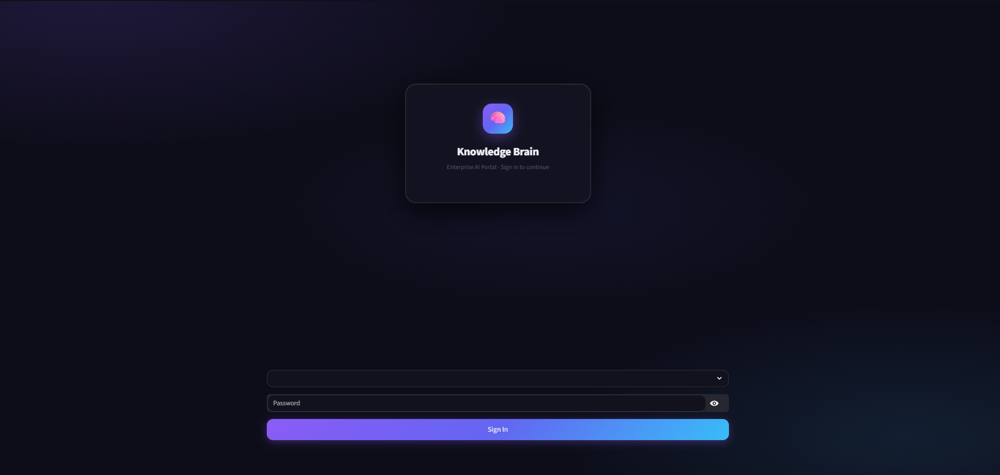
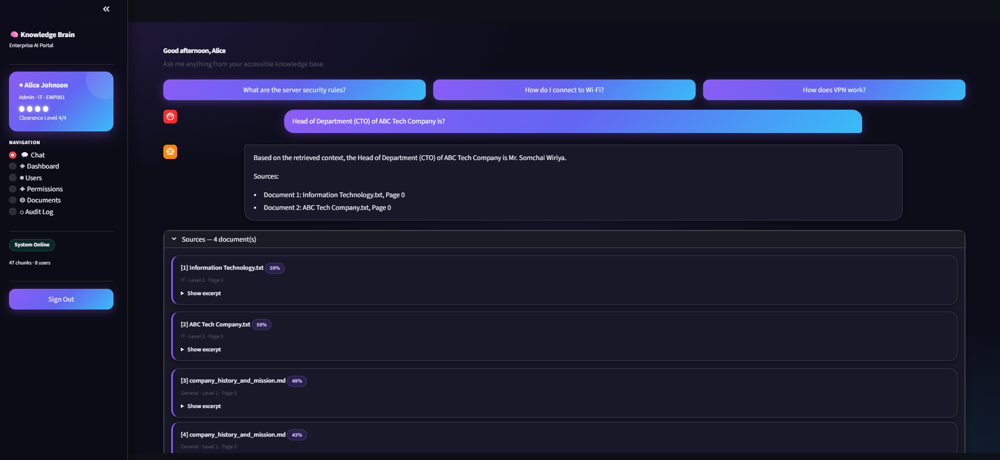
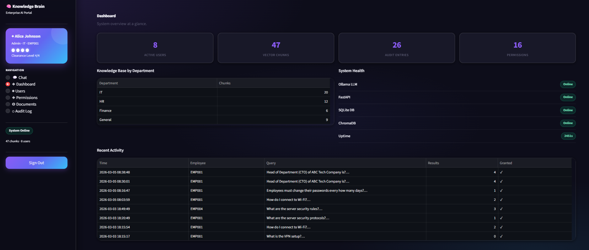
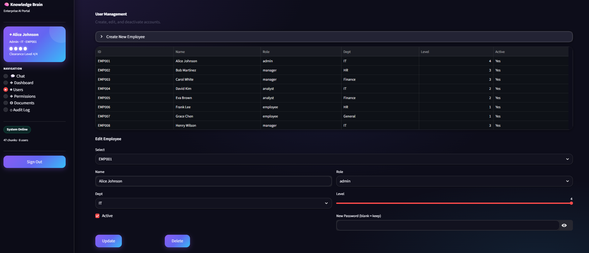
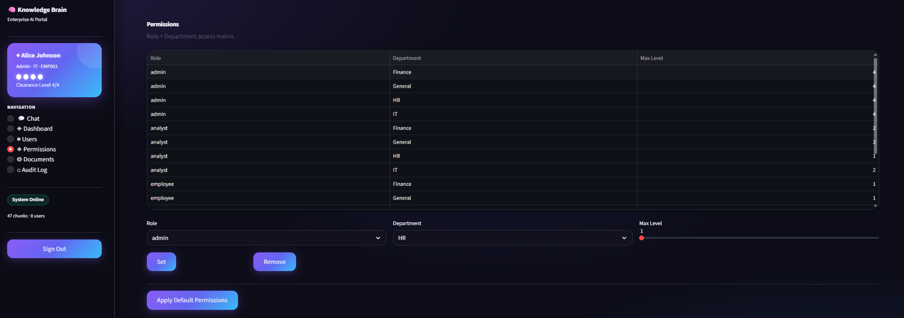
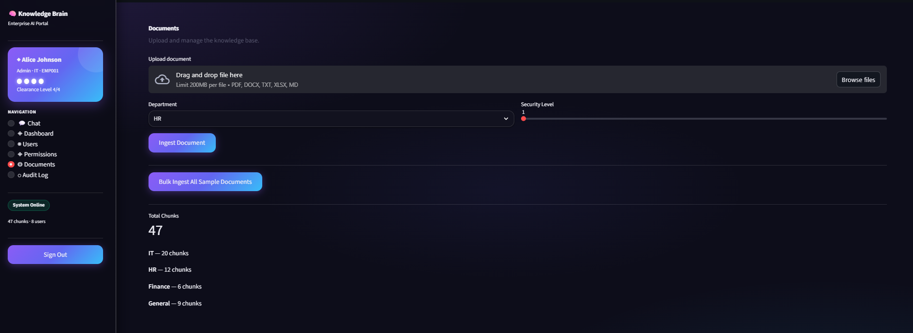

# 🧠 Enterprise Knowledge Brain

> **Local RAG system with Role-Based Access Control — runs 100% on-premise, zero cloud dependency.**


---








---

## ✨ Features

| Category | What's included |
|---|---|
| 🔐 **Authentication** | Login wall — You must sign in to view the content. |
| 👥 **RBAC** | 4 roles × 4 departments × 4 security levels |
| 🤖 **Local LLM** | Ollama + Llama 3.2 — Data does not leave the device. |
| 🔍 **RAG Pipeline** | ChromaDB + all-MiniLM-L6-v2 embeddings |
| 📡 **Streaming** | SSE streaming via FastAPI → `st.write_stream` |
| 📄 **Multi-format** | Supports PDF, DOCX, XLSX, TXT, Markdown |
| 🧱 **Bento UI** | Dark theme, glassmorphism, Gemini-style chat |
| 📊 **Admin Panel** | CRUD users, permissions, documents, audit log |
| 🐳 **Docker** | `docker compose up` With RAM limits |
| 📝 **Audit Log** | Every query is logged — employee_id, dept, timestamp |

---

## 🏗️ Architecture

```
┌──────────────────────────────────────────────────────────┐
│  Streamlit UI  :8501  (Dark Bento Theme)                 │
│  Login Wall → Role-gated Navigation                      │
└──────────────────┬───────────────────────────────────────┘
                   │  httpx (REST + SSE)
┌──────────────────▼───────────────────────────────────────┐
│  FastAPI  :8000                                           │
│  POST /query         — sync RAG                          │
│  POST /query/stream  — SSE streaming                     │
│  POST /ingest        — document upload (admin)           │
│  GET  /health        — system health check               │
│  GET  /stats         — vector store stats                │
│  DELETE /document    — remove from vector store          │
└──────┬────────────────────┬──────────────────────────────┘
       │                    │
  ┌────▼─────┐        ┌─────▼──────┐        ┌────────────┐
  │  SQLite  │        │  ChromaDB  │        │   Ollama   │
  │  RBAC    │        │  Vectors   │        │ Llama 3.2  │
  │  Audit   │        │ (on-disk)  │        │  :11434    │
  └──────────┘        └────────────┘        └────────────┘
```

---

## 🚀 Quick Start

### Prerequisites
- Python 3.11+
- [Ollama](https://ollama.ai) installed
- 8 GB RAM (2 GB for Llama 3.2, 1 GB for app)

### 1. Clone & Install

```bash
git clone https://github.com/Punyisa-m/Enterprise-Knowledge-Brain.git
cd enterprise-knowledge-brain
pip install -r requirements.txt
```

### 2. Pull LLM model

```bash
ollama pull llama3.2
```

### 3. Setup database & seed users

```bash
python scripts/setup_db.py
```

get demo users:

| Name | ID | Password | Role |
|---|---|---|---|
| Alice Johnson | EMP001 | `admin123` | Admin |
| Bob Martinez | EMP002 | `hr_mgr` | Manager |
| Frank Lee | EMP006 | `hr_emp` | Employee |
| Grace Chen | EMP007 | `gen_emp` | Employee |

### 4. Start services

```bash
# Terminal 1 — LLM server
ollama serve

# Terminal 2 — AI API
uvicorn src.api:app --port 8000

# Terminal 3 — UI
streamlit run src/app.py
```

Open [http://localhost:8501](http://localhost:8501) ✅

---

## 🐳 Docker

```bash
# Build & start everything
docker compose up --build -d

# Pull model inside Ollama container (first time only)
docker exec ekb_ollama ollama pull llama3.2

# Logs
docker compose logs -f app
```

### RAM budget (8 GB machine)

| Service | Limit | Notes |
|---|---|---|
| `app` | 1 GB | Embeddings + ChromaDB client |
| `ollama` | 6 GB | Llama 3.2 3B Q4 ≈ 2 GB |
| OS | 0.5 GB | Headroom |

---

## 📁 Project Structure

```
enterprise-knowledge-brain/
├── src/
│   ├── api.py            # FastAPI — RAG endpoints + SSE streaming
│   ├── app.py            # Streamlit — Dark UI + RBAC navigation
│   ├── database.py       # SQLite RBAC — full CRUD, no hardcoded data
│   ├── vector_store.py   # ChromaDB persistent client + ingestion
│   ├── llm_engine.py     # Ollama connector
│   └── rag_pipeline.py   # Orchestrator — retrieval → filter → generate
├── scripts/
│   ├── create_sample_docs.py # First-time create sample docs
│   └── setup_db.py       # First-time DB setup + seed users
├── documents/            # Source documents 
│   ├── hr/
│   ├── it/
│   ├── finance/
│   └── general/
├── database/             # SQLite + ChromaDB files
├── logs/                 # Loguru rotating logs
├── docs/
│   └── screenshots/      # README images
├── Dockerfile
├── docker-compose.yml
├── docker-entrypoint.sh
└── requirements.txt
```

---

## 🔐 RBAC Design

```
Role          │ HR  │ IT  │ Finance │ General
──────────────┼─────┼─────┼─────────┼────────
admin         │ L4  │ L4  │ L4      │ L4
manager       │ L3  │ L3  │ L3      │ L2
analyst       │ L1  │ L2  │ L2      │ L2
employee      │ L1  │ L1  │ L1      │ L1
```

- Dynamic ChromaDB filters are generated per user session
- `$and [ department $in [...] , security_level $lte N ]`
- No hardcoded permissions in the code — they can be modified through the UI

---

## 🛠️ Tech Stack

**AI / RAG**
- Ollama + Llama 3.2 (local inference)
- ChromaDB (persistent vector store)
- Sentence Transformers `all-MiniLM-L6-v2` (local embeddings)
- LangChain (document loaders + text splitter)

**Backend**
- FastAPI + Uvicorn (1 worker)
- SSE Starlette (streaming)
- SQLite + WAL mode (RBAC + audit)
- Loguru (rotating logs)

**Frontend**
- Streamlit 1.35
- Custom CSS — Dark glassmorphism, Bento grid, Gemini-style chat

**DevOps**
- Docker + docker-compose (memory limits)
- python:3.11-slim base image

---

## ⚡ Performance Tips (8 GB RAM)

| Technique | Effect |
|---|---|
| `lazy_load()` on loaders | Preventing MemoryError on large PDF |
| Batch upsert (50 chunks) | Optimize in-memory list usage |
| `gc.collect()` Every page | Release memory back to the OS faster |
| 1 Uvicorn worker | Do not duplicate the embedding model |
| ChromaDB PersistentClient | Vectors are stored on disk, not in RAM |
| SSE streaming | No need to buffer all responses beforehand |

---

## 📡 API Reference

| Method | Endpoint | Auth | Description |
|---|---|---|---|
| `GET` | `/health` | — | System health + Ollama status |
| `GET` | `/stats` | — | Vector store + DB stats |
| `POST` | `/query` | Employee | Synchronous RAG query |
| `POST` | `/query/stream` | Employee | SSE streaming RAG |
| `POST` | `/ingest` | Admin | Upload & ingest document |
| `DELETE` | `/document/{name}` | Admin | Remove from vector store |

Interactive docs: [http://localhost:8000/docs](http://localhost:8000/docs)

---

## ☁️ Free Deployment Options

### Streamlit Community Cloud
1. Push to GitHub (public repo)
2. [share.streamlit.io](https://share.streamlit.io) → New app → `src/app.py`
3. Add secret: `API_BASE = "https://your-fastapi-server.com"`

### Hugging Face Spaces (Docker)
1. Create Space → SDK: Docker
2. Upload project files
3. ใช้ `llama3.2:3b` แทน (2 GB — fits free tier)


---

## 📄 License

MIT © 2025 — Free to use, modify, and distribute.

---

<p align="center">Built with ❤️ · Local-first · Privacy-first · Free forever</p>